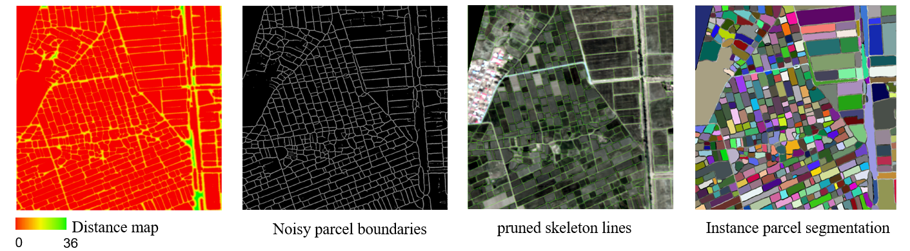
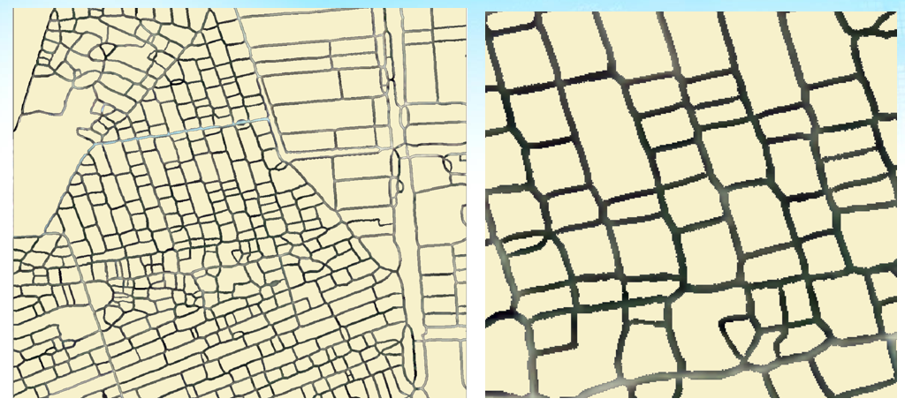
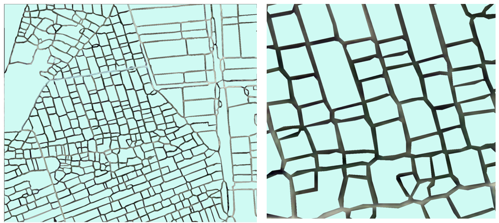
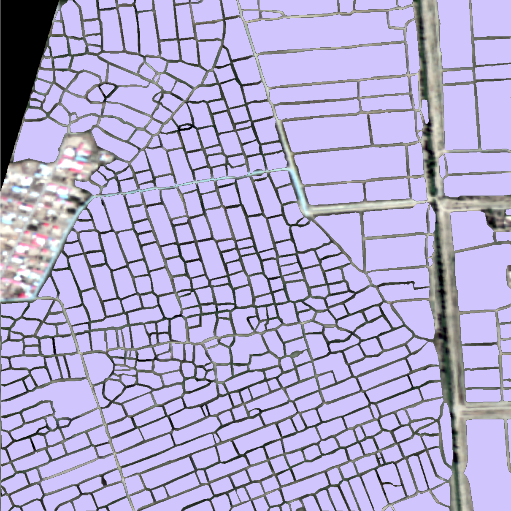

# From Edge Probability Map to Vector Parcels: An Effective Cropland Post-Processing Pipeline

**Huaming Gao**

*State Key Laboratory of Remote Sensing and Digital Earth*

*2025.10.22*


## 🎯 1. 项目概述与核心问题 (Project Overview & Core Problem)

本项目旨在提供一个**从深度学习模型输出的边缘概率图 (Edge Probability Map) 到生产级矢量地块 (Production-Ready Vector Parcels) 的全自动化后处理管线**。

在农田遥感监测中，深度学习模型能够有效识别地块边界。然而，其直接输出的栅格结果普遍存在以下问题，无法直接用于下游的GIS分析与农业管理：

  * **噪声与伪影**: 存在椒盐噪声和孤立的像素点。
  * **边界不一致**: 边界断裂、宽度不一。
  * **拓扑错误**: 存在悬挂线 (dangling lines) 等不正确的连接。
  * **锯齿问题**：栅格矢量化后大量锯齿问题。

本管线通过一系列创新的图像处理、拓扑分析和几何计算，系统性地解决了这些挑战，致力于将粗糙的栅格预测转化为**干净、拓扑正确、几何精确**的矢量数据。

-----

## ✨ 2. 核心特性与创新点 (Key Features & Innovations)

本管线凝结了一系列算法探索与创新，其核心贡献在于开发了一套鲁棒、高效且科学的后处理流程，以应对真实世界遥感数据的复杂性：

  * **📐 基于几何形态的边界中心线提取**:
    摒弃了在充满噪声的原始强度图上直接操作的传统思路。我们创新性地利用**距离变换 (`Distance Transform`)** 将边界区域转化为具有清晰几何结构的“山脊”地形图，再结合 **Hessian 矩阵分析 (Meijering 滤波器)** 精确提取“山脊线”，从根本上保证了中心线的平滑性与鲁棒性。
    
  * **🧠 高速拓扑感知的骨架剪枝算法**:
    针对骨架化过程中产生的“悬挂线”伪影，我们开发了一套高效的剪枝算法 `prune_dangling_lines_fast`。该算法基于标准的**交叉数 (`Crossing Number`)** 定义精确识别拓扑末端点，并通过查找表 (LUT) 与卷积相结合的方式实现了完全向量化，能彻底、高效地清除所有层级的悬挂线。

  * **🎨 几何保真的可变宽度重建**:
    采用“拓扑清理 + 几何重建”的解决方案。在获得拓扑干净的单像素骨架后，利用距离变换的索引功能，为骨架上的每个点并行匹配其在原始边界掩码中的真实“半径”。这既恢复了边界的真实宽度，也完美保留了其多样性和不均匀性，避免了传统固定宽度膨胀导致的信息损失。

  * **🌍 投影感知的矢量处理**:
    在矢量平滑与简化阶段，严格遵循GIS最佳实践。所有依赖距离的计算（如滑动窗口平滑、Douglas-Peucker简化）都在**投影坐标系 (UTM)** 下进行，确保了 `tolerance` 等参数具有明确的米制单位，避免了在WGS84等地理坐标系下操作导致的变形，保证了地理精度。

  * **🧩 模块化的完整处理链**:
    将复杂流程拆分为 `thinning.py` (栅格处理)、`smooth.py` (矢量后处理)、`filter_by_cropland.py` (语义过滤) 等多个独立脚本，提高了代码的可维护性、可重用性和流程的灵活性。

-----

## 🔧 3. 技术管线详解 (The Technical Pipeline)

整个工作流从输入的边缘概率图 GeoTIFF 开始，到输出最终的农田地块 Shapefile 结束。

### **阶段一：栅格边界精炼与拓扑清理**

  * **脚本**: `thinning.py`
  * **输入**: 原始边缘概率图 GeoTIFF (假设边界为暗值)。
  * **核心步骤**:
    1.  **构建距离图**: 反转概率图 → 形态学清理 → `distance_transform_edt`。
    2.  **提取中心线**: 对距离图应用 Hessian (Meijering) 滤波器 → Otsu 自动阈值。
    3.  **处理边缘效应**: 添加外围边界框架 `add_thick_border_frame`。
    4.  **骨架化**: (可选) 提取最大连通域 → `skeletonize`。
    5.  **拓扑剪枝**: 应用高速向量化剪枝 `prune_dangling_lines_fast`。
    6.  **几何重建**: 应用可变宽度重建 `reconstruct_variable_width_from_skeleton`。
    7.  **实例分割与过滤**: `label` + `remove_small_objects`。
  * **输出**: 临时的、带地理信息的、已清理的栅格实例图 (GeoTIFF)。
 

### **阶段二：矢量化 (Vectorization)**

  * **脚本**: `thinning.py` (内部调用 `line2shp` 函数)
  * **输入**: 阶段一输出的栅格实例图。
  * **核心步骤**: 调用 `gdal.Polygonize()` 将栅格转换为矢量多边形。
  * **输出**: 原始的、带有锯齿边界的矢量地块文件 (Shapefile)。

### **阶段三：矢量后处理 (Vector Post-Processing)**

  * **脚本**: `smooth.py`
  * **输入**: 阶段二输出的原始矢量文件 (WGS84)。
  * **核心步骤**:
    1.  **顶点简化**:（先简化后平滑，避免锯齿被视为顶点保留）
        * **投影**: WGS84 → UTM (`_reproject_layer`)。
        * **简化**: 在UTM下应用 Douglas-Peucker (`geom.Simplify`)，容差以米为单位。
        * **反向投影**: UTM → WGS84 (`_reproject_layer`)。
    2.  **边界平滑**: 应用基于滑动窗口的方向保持平滑算法 `smooth_parcels_by_window`。

  * **输出**: 边界平滑、顶点数量合理的优化矢量文件 (Shapefile, WGS84)。


### **阶段四：语义过滤 (Semantic Filtering)**

  * **脚本**: `filter_by_cropland.py`
  * **输入**: 阶段三输出的优化矢量文件和耕地范围栅格掩膜 (Mask TIF)。
  * **核心步骤**: 计算每个地块与耕地掩膜的重叠率 (`filter_parcels_by_mask_gdal`)，并根据阈值过滤。
  * **输出**: **最终的、高质量的农田地块矢量成果 (Shapefile)**。

-----

## 🚀 4. 快速上手指南 (How to Use)

### **4.1. ⚙️ 环境配置**

> **强烈建议**: 使用 Conda 创建独立的 Python 环境，并从 `conda-forge` 渠道安装所有依赖，以确保库之间的兼容性。

```bash
# 创建新环境 (建议 Python 3.8 或更高版本)
conda create -n geo_env python=3.9

# 激活环境
conda activate geo_env

# 从 conda-forge 安装所有必需的库
conda install -c conda-forge gdal scikit-image scipy matplotlib opencv numpy pandas
```

### **4.2. 📦 依赖库**

  * `numpy`
  * `gdal` (osgeo)
  * `opencv-python` (cv2)
  * `scikit-image` (skimage)
  * `scipy`
  * `matplotlib` (用于可视化)
  * `pandas` (skan 剪枝算法可能需要)

### **4.3. 🏃 运行流程**

按顺序执行以下 Python 脚本。

> **重要**: 在运行前，请务必根据您的文件路径和参数需求，修改每个脚本末尾的 `if __name__ == '__main__':` 部分。

1.  **执行栅格处理与矢量化**

      * **脚本**: `thinning.py`
      * **配置**: 设置输入 `in_raster` 和输出 `shapefile_filename`。
      * **运行**: `python thinning.py`

2.  **执行矢量平滑与简化**

      * **脚本**: `smooth.py`
      * **配置**: 设置输入 `input_shp`，输出 `output_shp_simple`。
      * **关键参数**: 务必设置正确的 `TARGET_UTM_EPSG_CODE`。根据需要调整 `window_size` 和 `tolerance_in_meters`。
      * **运行**: `python smooth.py`

3.  **执行语义过滤**

      * **脚本**: `filter_by_cropland.py`
      * **配置**: 设置输入 `parcel_shp`，耕地掩膜 `mask_tif`，以及最终输出 `output_shp`。
      * **关键参数**: 调整重叠率 `threshold` (0到1之间)。
      * **运行**: `python filter_by_cropland.py`

-----

  ### **4.4 使用入口脚本 main.py（推荐）**

  本项目自带 `main.py` 作为统一入口，默认按顺序运行完整管线：thinning -> smooth -> filter。该脚本方便快速运行与参数传递，也支持只运行单个阶段。

  示例：

  - 完整运行（使用 README 中示例路径）：

  ```
  python main.py
  ```

  - 指定输入/输出并保留中间结果：

  ```
  python main.py --in_raster edge_map/GF_NM_T48TXL_E67970_N450984.tif --mask cropland/GF_NM_T48TXL_E67970_N450984.tif --out_dir out_dir --keep
  ```

  - 只运行单个阶段（例如只运行 smooth）：

  ```
  python main.py --step smooth --out_dir out_dir
  ```

  - dry-run（仅打印将执行的命令，不实际运行）：

  ```
  python main.py --dry-run
  ```

  常用选项说明：

  - `--in_raster`: 输入边缘概率图（默认仓库里有示例路径）。
  - `--mask`: 耕地掩膜（filter 阶段需要）。
  - `--out_dir`: 输出目录（默认 `out_dir`）。
  - `--keep`: 是否保留中间结果（默认不保留）。
  - `--step`: 只运行单个阶段（thinning/smooth/filter）。
  - `--extra`: 向底层脚本传递额外参数（示例: `--extra "--sigma 2 --tolerance 3"`）。

  注意：单阶段运行模式 (`--step`) 要求相应的输入存在（例如 `smooth` 需要 `thinning` 的输出）。


## 📚 5. 引用 (Citation)

如果本项目对您的研究有所帮助，请考虑引用以下内容：

  * **核心算法思想**:
    Huaming,Gao (2025). *An Effective Post-Processing Pipeline for Cropland Parcel Vectorization*. [Algorithm Documentation]. State Key Laboratory of Remote Sensing and Digital Earth, Aerospace Information Research Institute, Chinese Academy of Sciences.
  * **关键技术与库**:
      * **GDAL/OGR**: GDAL/OGR Contributors. (2023). *GDAL/OGR Geospatial Data Abstraction software Library*. Open Source Geospatial Foundation.
      * **Scikit-image**: Van der Walt, S., et al. (2014). *scikit-image: image processing in Python*. PeerJ.
      * **SciPy**: Virtanen, P., et al. (2020). *SciPy 1.0: fundamental algorithms for scientific computing in Python*. Nature methods.
      * **OpenCV**: Bradski, G. (2000). *The OpenCV Library*. Dr. Dobb's Journal of Software Tools.
      * **NumPy**: Harris, C. R., et al. (2020). *Array programming with NumPy*. Nature.
  * **启发性工作**:
    Wu, W., et al. (2023). *Multilevel segmentation algorithm for agricultural parcel extraction from a semantic boundary*. International Journal of Remote Sensing.

-----

## 🔭 6. 未来展望 (Future Outlook)

  * **并行化处理**: 将分块处理（Tiling）策略与 `multiprocessing` 库结合，以在多核 CPU 上并行处理大范围影像。
  * **参数自动化**: 探索基于图像特征自动确定平滑、简化和过滤参数最优值的方法。
  * **拓扑修复**: 在矢量化后，增加更高级的拓扑检查与修复步骤（如使用 GEOS 修复微小的几何错误）。
  * **用户界面**: 开发一个简单的图形用户界面（GUI），方便非编程背景的研究人员使用。